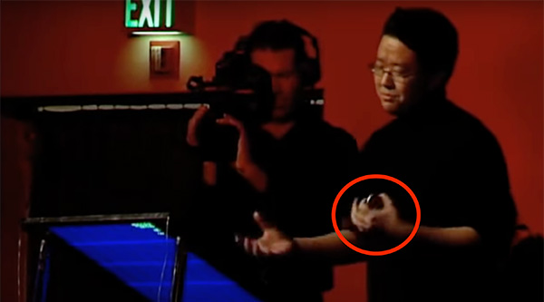
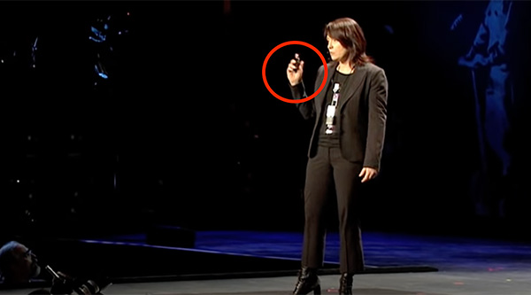
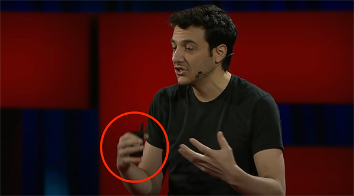
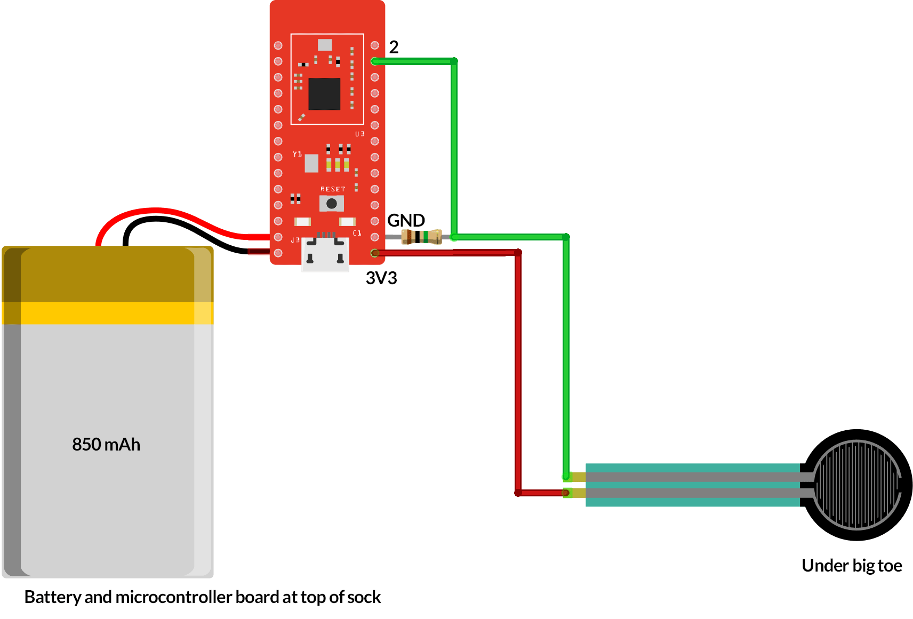

# SoleControl: A presentation remote that minimizes distractions

Every have to give a presentation in front of an audience? How do you keep your slides progressing? You could awkwardly call out "Next!" to a friend in the audience who is by the presenting computer, but most people just use wireless presenter remotes.

These remotes are effective, and some even come with cool built-in laser pointers (which is great if you have a cat), but these remotes stand between you and your audience and present a visual distraction. 

SoleControl is a project that allows you to free your hands and engage your audience - by placing the presentation remote under your foot!

By placing a force sensor under the big toe, you can be completely free to move around the stage and present to your audience unencumbered by distractions. 

Your audience can focus on you and your points, not your tech.

There are so many great presentations out there that have unfortunately succumbed to handheld remotes. (Chris Anderson, if you're reading this, [let's talk](https://zachrattner.com/#contact).)

## Jeff Han: Unveiling the genius of multi-touch interface design

## Pattie Maes: Unveiling game-changing wearable tech

## Tim Urban: Inside the mind of a master procrastinator

## Bill of Materials
- [SparkFun Pro nRF52840 Mini - Bluetooth Development Board](https://www.sparkfun.com/products/15025)
- [Lithium Ion Battery - 850mAh](https://www.sparkfun.com/products/13854)
- [FlexiForce Pressure Sensor - 100lbs](https://www.sparkfun.com/products/8685)
- [1 MΩ Resistor - 1/4 W](https://www.amazon.com/dp/B08FD1XVL6?ref=ppx_yo2ov_dt_b_product_details&th=1)
- [2-pin Jumpers](https://www.amazon.com/dp/B07NM68FXK?psc=1&ref=ppx_yo2ov_dt_b_product_details) (2x)
- [22 AWG Hookup Wire](https://www.amazon.com/TUOFENG-Hookup-Wires-6-Different-Colored/dp/B07TX6BX47)
- [Lead-Free Solder](https://www.amazon.com/Weller-T0051404799-Lead-Solder-Sn99-3Cu0-6Ni0-05/dp/B09LDHLM1F)
- [Electrical Tape](https://www.amazon.com/gp/aw/d/B01LY3FG50)
- [Duct Tape](https://www.amazon.com/Heavy-Duty-Silver-Duct-Yourself/dp/B078M5N8CH)
- A sock that fits you well

## Helpful Tools
These items were not part of the actual Bill of Materials, but were helpful in assembling the device.

- [FNIRSI DSO152 Oscilloscope](https://www.amazon.com/dp/B0C6XPVLPZ?ref=ppx_yo2ov_dt_b_product_details&th=1)
- [Wire Strippers](https://www.amazon.com/KAIWEETS-Wire-Stripper-Stripping-Strippers/dp/B097SWN1C7)
- [Soldering Station](https://www.amazon.com/Weller-Digital-Soldering-Station-WE1010NA/dp/B0B3GXSWTG?th=1)

## Schematic
*Note: The board in the schematic below is not an exact image of the SparkFun Pro nRF52840 Mini. Make sure you connect the pin numbers as listed in the diagram*  

## Setup instructions

1. Connect the LiPo battery to the development board
2. Connect the development board to your computer and load the firmware onto the board
3. Once the device boots up, go to your computer settings and pair the device over Bluetooth
4. Connect the parts according to the schematic. I found it easiest to solder long wires (about 1 foot) onto the 3V3 (red), GND (black), and analog pin 2 (green), then place the components on the sock while you're wearing it. Once you get things in the right place, mark off with permanent marker on the wire where the cut points should be and make the cuts. 
5. Hold the electronics onto the sock. If you are a gifted seamstress you can sew a small pouch onto the sock. I am not, however, and just used duct tape. 

## Copyright, License Info, and Disclaimers
See [LICENSE.md](LICENSE.md)